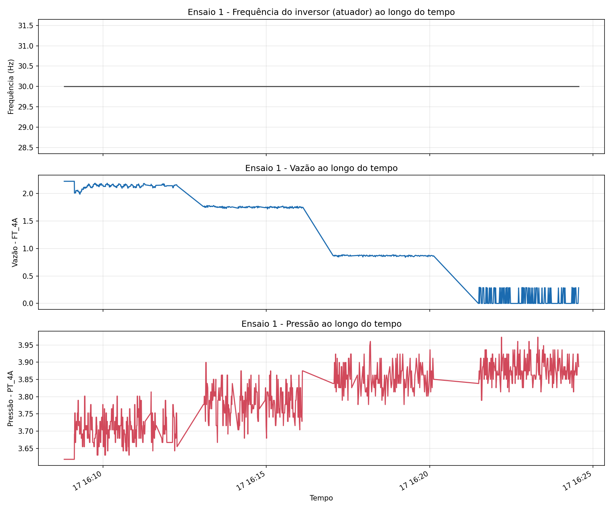
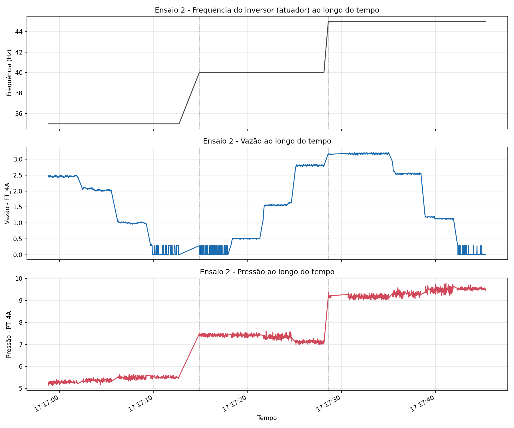
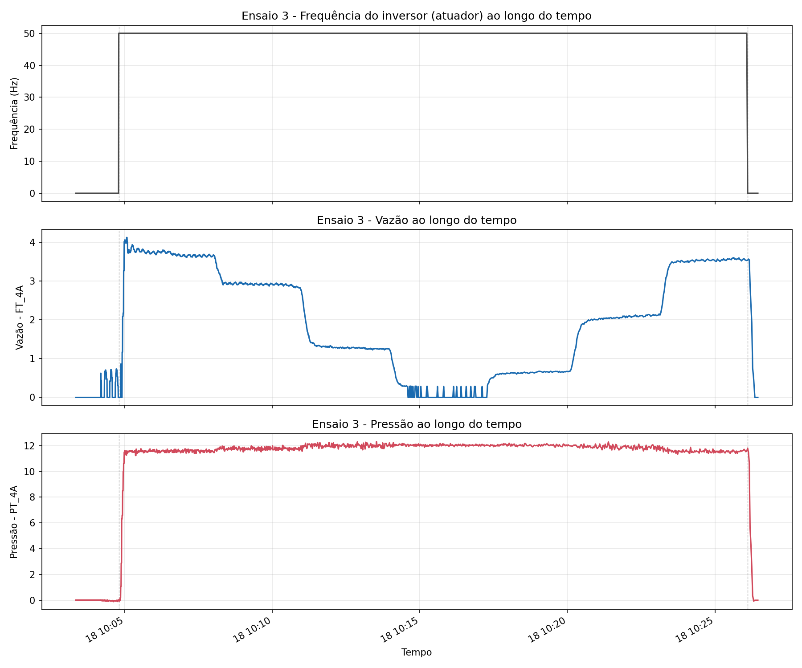

# Comportamento da Planta no Domínio do Tempo — PT_4A, FT_4A e Inversor

Este documento comenta os resultados gerados por `figuras_dominio_tempo.py` a partir
dos dados coletados na planta do LENHS/UFPB (`DadosTratados.xlsx`), com foco na
variável controlada **PT_4A** (pressão) e no seu par de vazão **FT_4A**, atuados pela
**frequência do inversor** (velocidade da bomba centrífuga) e perturbados pela
abertura da **válvula CV_4A**.

## 1. Estrutura real da coleta

A coleta de dados não é um único ensaio contínuo: existem pausas de reconfiguração
do inversor entre patamares de frequência, sendo a maior delas de ~16h (troca de dia,
bomba desligada) e uma de ~34 min entre os patamares de 30 Hz e 35 Hz. Ignorar essas
pausas faria o gráfico interpolar uma reta entre os dois lados do intervalo,
sugerindo de forma enganosa uma queda/subida gradual de pressão e vazão que nunca
ocorreu — a bomba estava simplesmente parada ou sendo reconfigurada.

Por isso, os dados foram automaticamente segmentados em três ensaios contínuos
(quebra sempre que o intervalo entre amostras consecutivas ultrapassa 10 min):

| Ensaio | Início | Fim | Duração | Frequências (Hz) | Amostras |
|---|---|---|---|---|---|
| 1 | 17/07 16:08:48 | 17/07 16:24:33 | 15 min 45 s | 30 | 919 |
| 2 | 17/07 16:58:50 | 17/07 17:45:21 | 46 min 31 s | 35, 40, 45 | 3024 |
| 3 | 18/07 10:03:20 | 18/07 10:26:27 | 23 min 07 s | 0 (repouso), 50 | 1387 |

Dentro de cada patamar de frequência, o ângulo da válvula CV_4A é varrido de ~0°
(aberta) a ~30° (fechada), gerando o degrau de vazão/pressão observado dentro de
cada ensaio.

## 2. Figuras geradas

- `ensaio_1_dominio_tempo.png` — 30 Hz, varredura da válvula.
- `ensaio_2_dominio_tempo.png` — 35 → 40 → 45 Hz, três varreduras da válvula em sequência.
- `ensaio_3_dominio_tempo.png` — partida da bomba e patamar de 50 Hz.

Cada figura tem três subplots empilhados com o mesmo eixo de tempo: frequência do
inversor (atuador), vazão FT_4A e pressão PT_4A. Linhas verticais tracejadas marcam
as trocas de patamar de frequência.

## 3. Valores extremos por patamar de frequência

| Frequência (Hz) | FT_4A máx. | PT_4A máx. (shutoff) |
|---|---|---|
| 30 | 2,221 | 3,973 |
| 35 | 2,509 | 5,646 |
| 40 | 2,841 | 7,612 |
| 45 | 3,224 | 9,798 |
| 50 | 4,119 | 12,315 |

## 4. Aspectos físicos observados

**a) Estrangulamento pela válvula CV_4A (efeito dominante dentro de cada patamar).**
Em todos os ensaios, fechar a válvula (CV_4A crescente) reduz a vazão em direção a
zero e eleva a pressão até um valor máximo com vazão nula — o *shutoff head* da
bomba. Isso é visível nos "degraus" dos subplots de vazão e pressão dentro de cada
ensaio: cada nível de CV_4A corresponde a um ponto de operação diferente sobre a
mesma curva característica da bomba. É o comportamento clássico de um sistema
bomba + válvula de estrangulamento: a válvula não dissipa energia da bomba, apenas
desloca o ponto de operação ao longo da curva (H×Q) para uma condição de menor vazão
e maior pressão a montante.

**b) Leis de afinidade da bomba centrífuga entre patamares de frequência.**
Comparando os patamares (tabela da seção 3), tanto a vazão máxima quanto a pressão
de shutoff crescem com a frequência do inversor, na direção prevista pelas leis de
afinidade (vazão proporcional à rotação N; pressão proporcional a N²):

- Vazão: de 30→50 Hz o inversor sobe 1,67×; a vazão máxima sobe 4,119/2,221 = 1,85×
  (previsão linear: 1,67×) — desvio de ~11 %.
- Pressão: de 30→50 Hz a previsão quadrática seria 1,67² = 2,78×; a pressão de
  shutoff observada sobe 12,315/3,973 = 3,10× — desvio de ~12 %.

A concordância é boa nos patamares intermediários (erro de 3–8 % entre 30 e 45 Hz) e
o desvio cresce um pouco em 50 Hz, o que é esperado: perdas por atrito na tubulação
crescem com o quadrado da vazão e passam a pesar mais relativamente conforme a
rotação aumenta, além de o ponto de operação a 50 Hz se aproximar de um trecho mais
não linear da curva da bomba.

**c) Atraso hidráulico (tempo morto) entre atuação e resposta.**
Nas transições de frequência (linhas tracejadas), a pressão e a vazão não saltam
instantaneamente para o novo patamar — há uma subida/descida gradual ao longo de
alguns segundos antes da estabilização, associada à inércia do fluido nas tubulações
e ao próprio tempo de resposta do conjunto inversor–bomba. Esse atraso é relevante
para o projeto do controlador PI: limita o ganho e a velocidade de resposta que
podem ser usados em malha fechada sem gerar sobressinal ou oscilação.

**d) Comportamento em repouso.**
No Ensaio 3, antes da partida a 50 Hz (Inversor = 0), tanto FT_4A quanto PT_4A estão
próximos de zero (PT_4A mínimo de -0,107, dentro do ruído do sensor em repouso). Isso
confirma que, sem energia mecânica da bomba, não há pressão residual relevante no
ponto de medição de PT_4A — o sistema não armazena uma carga estática significativa
nesse trecho da rede quando a bomba está desligada.

## 5. Implicações para o controle de PT_4A

Os quatro aspectos acima resumem por que a planta é não linear e por que uma RNA é
adequada para modelá-la: a relação entre frequência do inversor e pressão em PT_4A
depende também da posição da válvula (perturbação externa ao controlador) e não é
puramente proporcional nem instantânea. O atraso hidráulico observado na seção 4c
define um limite prático de largura de banda para o controlador PI — ganhos
agressivos tendem a excitar esse atraso e gerar oscilação em torno do setpoint.
